<div align="center">
  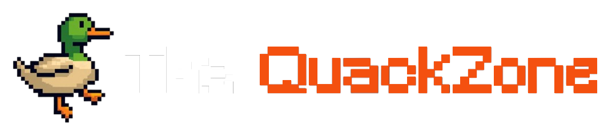
  <br><br>
  <p><strong>Tienda online de videojuegos con catálogo, carrito de compras, lista de deseos, reseñas, y más</strong></p>

  
  
  
  
  
</div>

<br>

The QuackZone es una tienda virtual de videojuegos con una interfaz moderna. Los usuarios pueden navegar el catálogo organizado por categorías, buscar juegos, ver detalles con capturas y reseñas, agregar al carrito, crear una lista de deseos, personalizar su perfil, y recibir notificaciones por correo. El frontend se conecta con un backend en Spring Boot que maneja la lógica de negocio y la autenticación, y con un microservicio Node.js que sirve de puente hacia APIs externas como RAWG, IGDB y CheapShark para obtener información actualizada sobre juegos.

---

## Capturas

### Inicio y catálogo
<div align="center">
  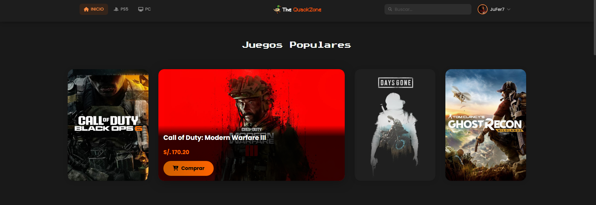
  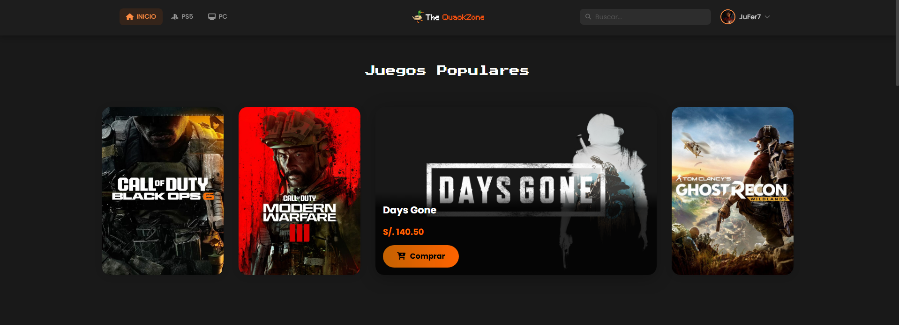
  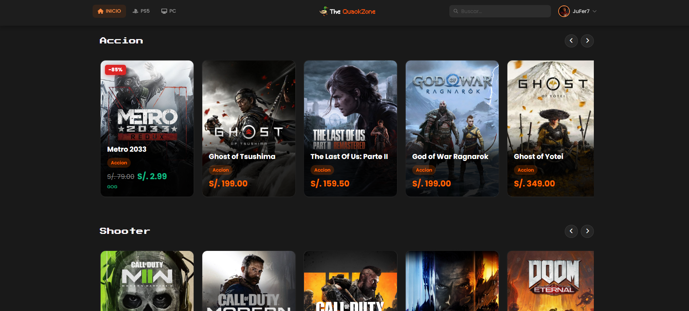
  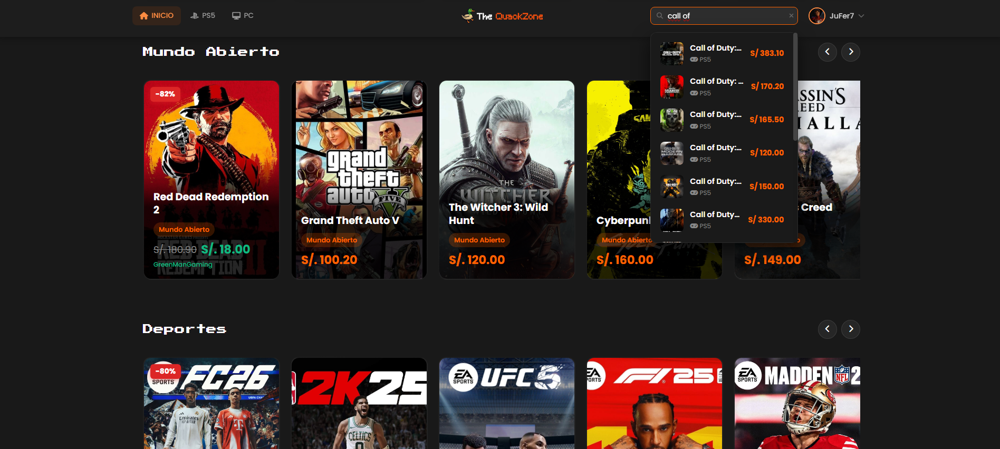
  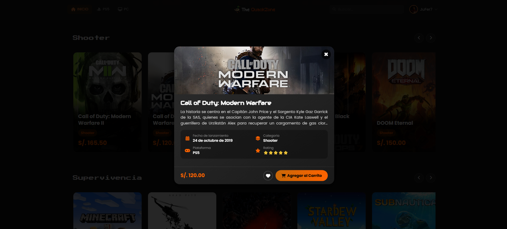
</div>

### Detalle del juego y plataformas
<div align="center">
  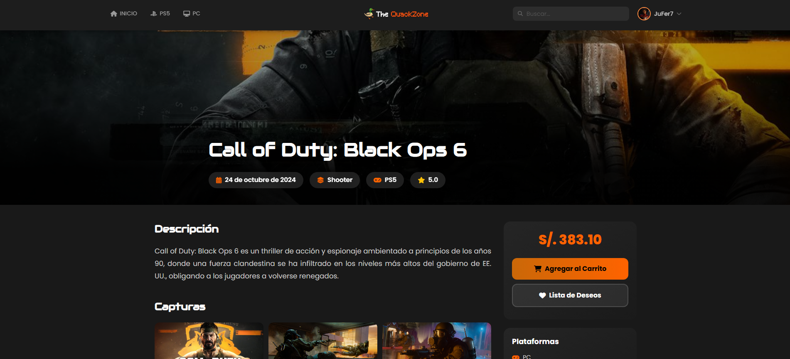
  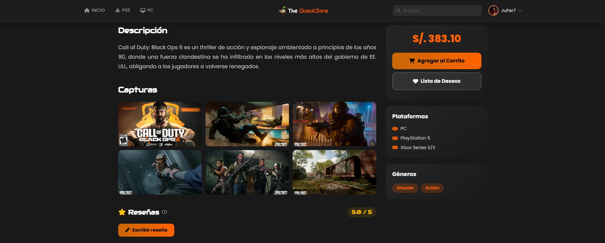
  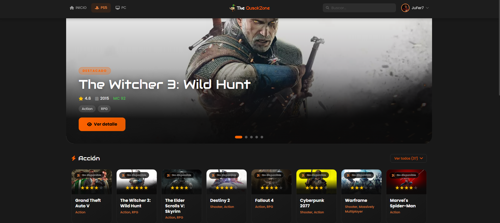
  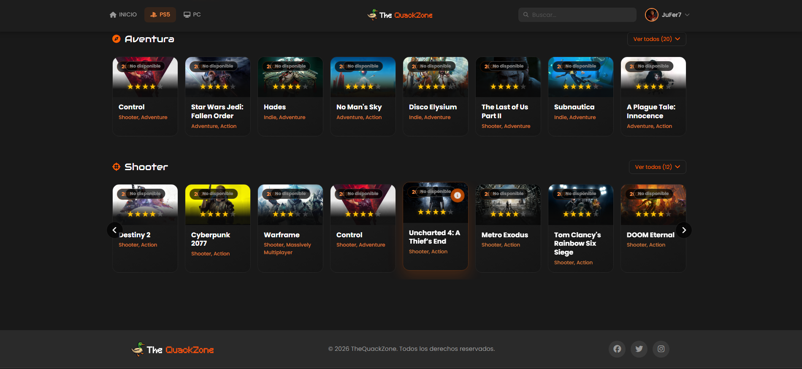
  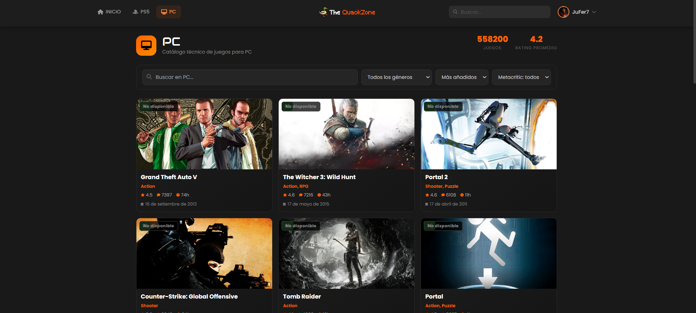
</div>

### Carrito de compras
<div align="center">
  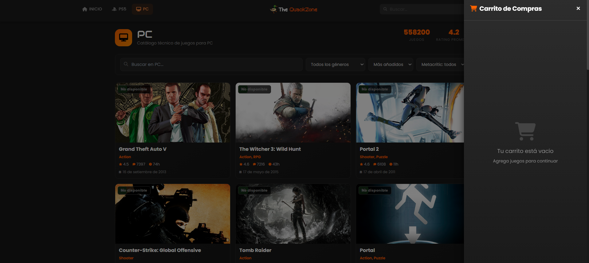
  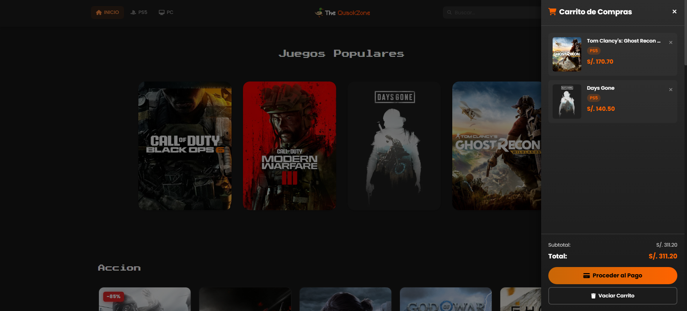
</div>

### Autenticación
<div align="center">
  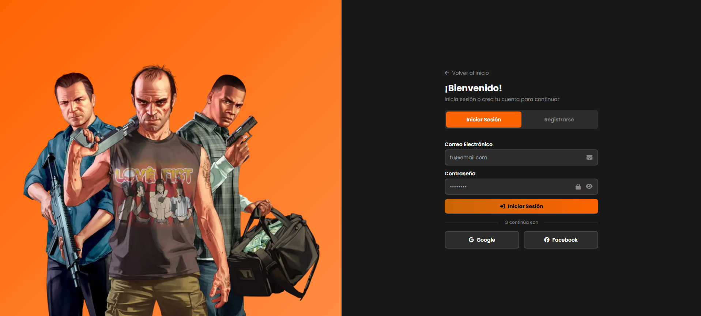
  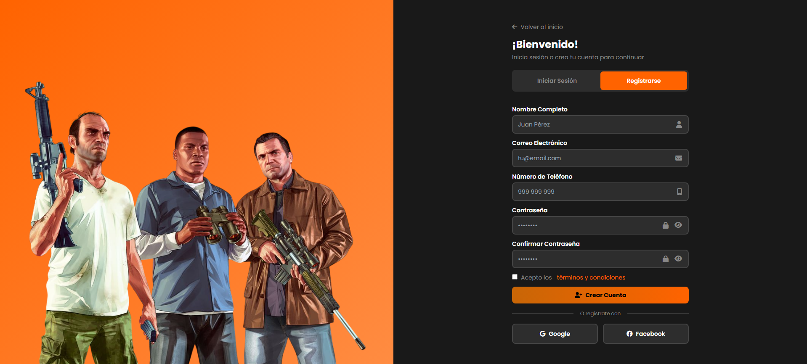
</div>

### Perfil
<div align="center">
  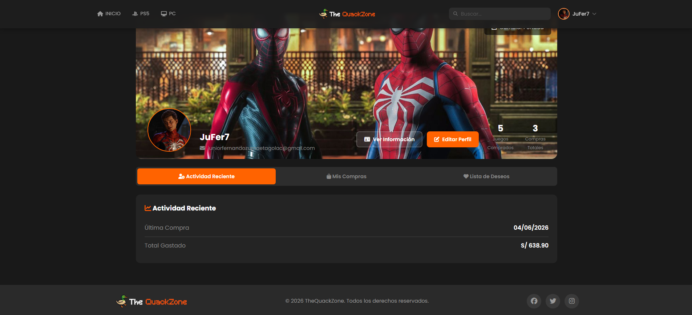
  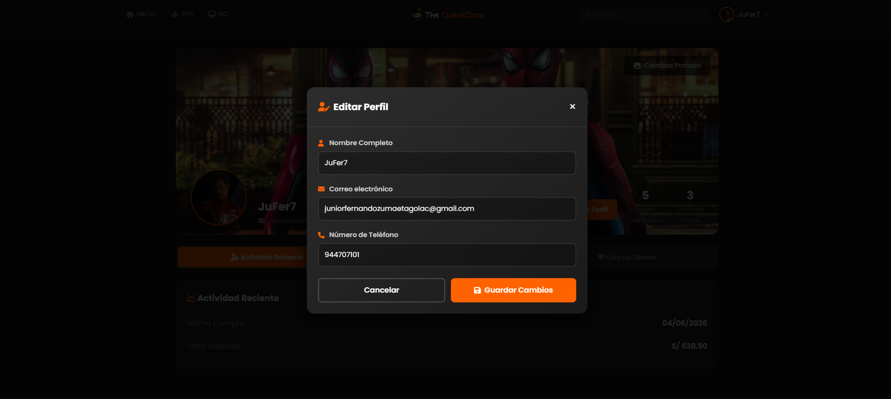
  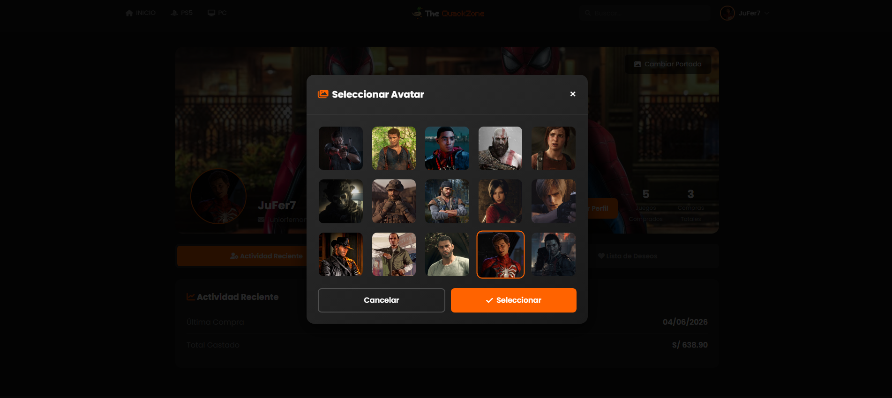
  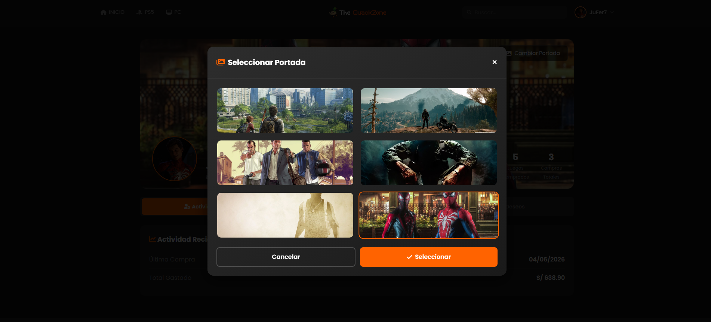
  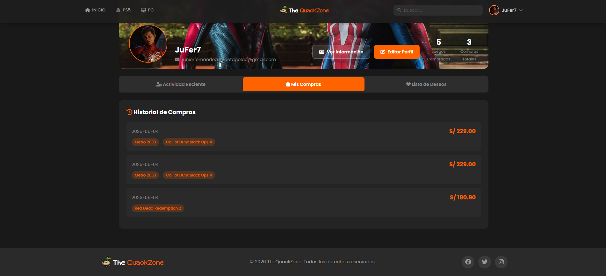
</div>

---

## Stack

| Capa | Tecnología |
|------|-----------|
| **Frontend** | Vue 3, Pinia, Vue Router, Tailwind CSS, Axios |
| **Backend** | Spring Boot 3, Spring Security, JPA / Hibernate, JWT (jjwt), Thymeleaf |
| **Microservicio** | Node.js, Express, Axios, Nodemailer |
| **Base de datos** | MySQL 8 |
| **Contenedores** | Docker, Docker Compose |

---

## Desarrollo local

### Requisitos

- Java 21+
- Node.js 20+
- MySQL 8
- Maven (o `mvnw` incluido)

### Pasos

```bash
# 1. Crear la base de datos
mysql -u root -p -e "CREATE DATABASE quackzone;"

# 2. Ejecutar datos semilla
mysql -u root -p quackzone < scriptBD.sql

# 3. Backend
cd backend
./mvnw spring-boot:run

# 4. Microservicio Node
cd servidor
npm install
npm run dev

# 5. Frontend
cd frontend
npm install
npm run dev
```

---

## Docker

```bash
docker-compose up -d
```

Levanta MySQL (`:3306`), backend (`:8080`) y Node service (`:4000`). El frontend se corre por separado con `npm run dev`.
